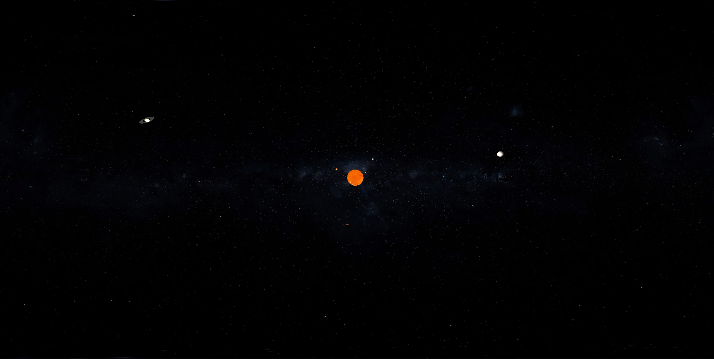

# The Solar System in ThreeJS
Link to GitHub Page: https://samuelmidgley.github.io/threejs-fun/

Model of the solar system built using ThreeJS. The distance from the sun to the planets is based on data provided by NASA. The size of the planets and sun is not accurate though
as you would not be able to see them.

In the process of adding:
- Additonal rings to the outer planets
- Orbit paths for all the planets
- Moons
- Changing speeds of planets to be more accurate
- Rotation to the planets

### References
All texure maps for planets downloaded from https://www.solarsystemscope.com/textures/
